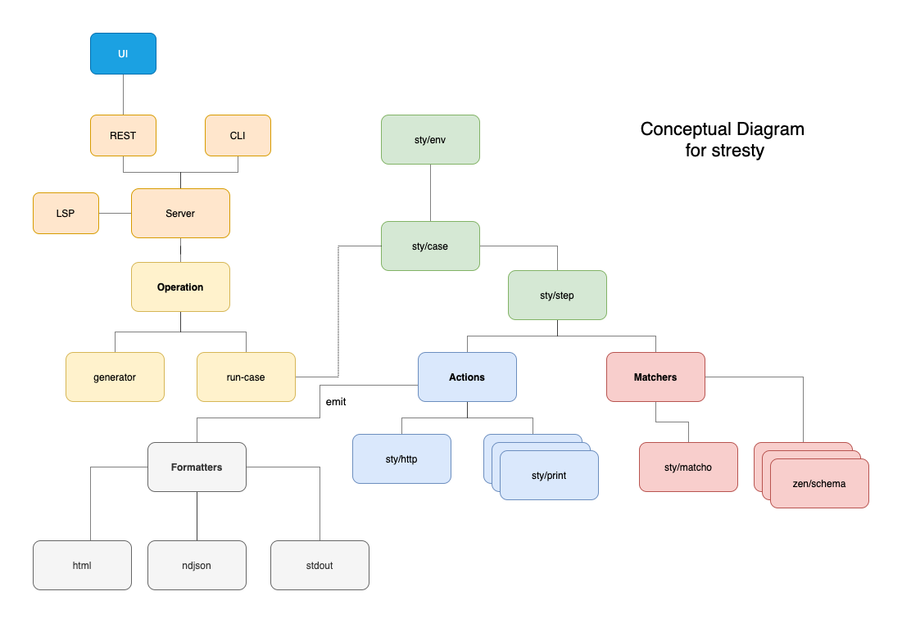

# Stresty

Stresty (sty) is zen data DSL to test your API in a declarative way!


## Getting started

mytest.edn
```edn
{ns mytest
 import #{sty}

 env
 {:zen/tags #{sty/env}
  :base-url "https://edgeniquola.edge.aidbox.app"
  :basic-auth {:user "???" :password "???"}}

 case
 {:zen/tags #{sty/case}
  :title "Patient track"
  :steps
  [{:id :create
    :desc  "create"
    :do {:act sty/http
         :method :post
         :url "/Patient"
         :body {:resourceType "Patient"}}
    :match {:by sty/matcho
            :status 201
            :body {:meta {:lastUpdated sty/string?
                          :versionId sty/string?}}}}

   {:id :read
    :desc  "read"
    :do {:act sty/http
         :method :get
         :url (str "/Patient/" (get-in sty/state [:create :body :id]))}
    :match {:by sty/matcho
            :status sty/ok?
            :body {:id (get-in sty/state [:create :body :id])
                   :meta {:lastUpdated sty/string?
                          :versionId sty/string?}}}}
   
   {:id :read-2
    :desc  "wrong read"
    :do {:act sty/http
         :method :get
         :url (str "/Patient/" (get-in sty/state [:create :body :id]))}
    :match {:by sty/matcho
            :status sty/ok?
            :body {:id (str "UPS-" (get-in sty/state [:create :body :id]))}}}
   ]
  }
 }

```

Run tests:

```sh
> sty --ns=mytest tests
```


## Installation

## Usage

```

sty --path=PATH <command> <subcommand>

sty server -p PORT

sty tests --envs=ENV1,ENV2 --cases=CS,CS  --steps=STEP,STEP --tags=TAG,TAG

sty watch --paths=PATH1,PATH2

sty (help) => help


```


## Development

### Overview



### Requirenments 

- GraalVM
- native-image util

### Setup

Setup via **jenv** (https://www.jenv.be/)

macos env

```
tar -xzf graalvm-ce-java11-darwin-amd64-21.0.0.2.tar.gz
sudo mv graalvm-ce-java11-21.0.0.2 /Library/Java/JavaVirtualMachines
/usr/libexec/java_home -V
sudo xattr -r -d com.apple.quarantine /Library/Java/JavaVirtualMachines/graalvm-ce-java11-21.0.0.2/Contents/Home
 
jenv add /Library/Java/JavaVirtualMachines/graalvm-ce-java11-21.0.0.2/Contents/Home
jenv versions
jenv local graalvm64-11.0.10
```

Setup via **SDKMAN** (https://sdkman.io/)


```
sdk ls java | grep grl            # find latest graalVM release
sdk install java 21.1.0.r16-grl   # install found release
sdk use java 21.1.0.r16-grl       # set it as default in current shell session
gu install native-image           # install native-image util
```
